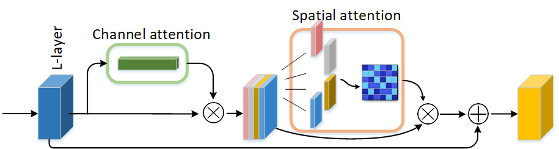
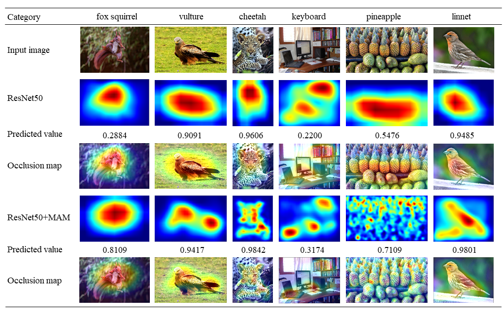

# code-MAMNet
# MAM: A Multipath Attention Mechanism for Image Recognition

The MXNet implementation of "MAM: A Multipath Attention Mechanism for Image Recognition"

## Structure

The overall architecture of MAM. The MAM consists of a channel attention module (CAM) and a spatial attention module (SAM). Channel attention models the correlation between feature channels and improves performance by enhancing essential features. Spatial attention captures the multi-scale information of interest regions in the featuremaps through multi-path.

## Requirements

* **Python3**
* **CUDA = 10.1**
* **MXNet = 1.5.1**
* **d2lzh**
* **matplotlib**

## Result

Classification performance achieved on Downsampled ImageNet. (MAMNet is the CNN network structure embedded with the MAM).

|   Models  | Top-1 acc  |  Top-5 acc |
|    ----   |    ----    |    ----    |
| ResNet50  |    60.43   |    82.48   |
| ResNet50-MAM  | 61.61  |    84.76   |

## Visualization

Quantitative evaluation results of Grad-CAM. Comparison of visualization results of the MAM integrated network (ResNet50 + MAM) and the baseline (ResNet50). The predicted value represents the softmax score of the network in the ground truth category.

## Citation

MAM: A Multipath Attention Mechanism for Image Recognition (Revised).

